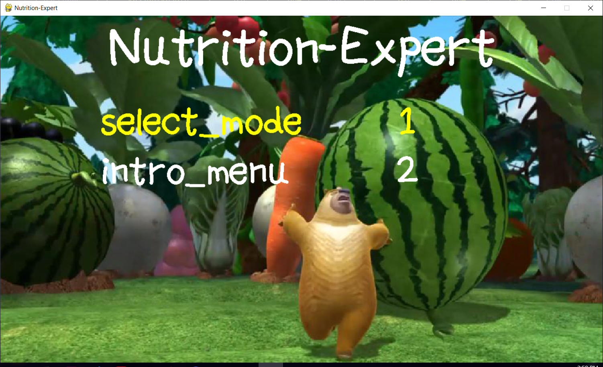

# Nutrition-Expert


An interactive 2-d game, providing knowledge about food & nutrition and FUN to people <br>
[Watch the demo video](https://www.youtube.com/watch?v=1K1vJ4ttd60&ab_channel=BruceZhu)

## Rules
1. Select a specific nutrient that you are interested in
2. Move the character to eat the food that contains the chosen nutrient
3. The scores depend on how much the chosen nutrient the food contains 
4. Each food (except for water) will increase character's satiation level
5. User's hydration level decreases by time. Drinking water will increase the hydration level
6. The game ends when either user's satiation level is full or hydration level is 0
7. There is a leaderboard recording the top 5 users for each nutrient 

## Set up VM and pygame
```sh
# Set up virtual environment
$ python3 -m venv venv

# Activate virtual environment
source venv/bin/activate # MacOS
venv\Scripts\Activate # PowerShell

# Install list of requirements from requirements.txt file
 (venv) $ pip3 install -r requirements.txt
```
## Play the game :)
```
python3 play.py
```

## Team Members
- Bruce Zhu
- Dongqiao He
- Vivien Guo
- Eric Li

## Asset credits
- dpren ([In-game music](https://freesound.org/people/dpren/sounds/320685/))
- pzuh ([Player sprite](https://pzuh.itch.io/the-boy-free-sprites))

## Dietary info credits
- [MyFoodData](https://www.myfooddata.com/). (Accessed April 21, 2022)
- [FoodData Central](https://fdc.nal.usda.gov/). (Accessed April 21, 2022)
- [Diet & Fitness Today](http://www.dietandfitnesstoday.com/). (Accessed April 21, 2022)
